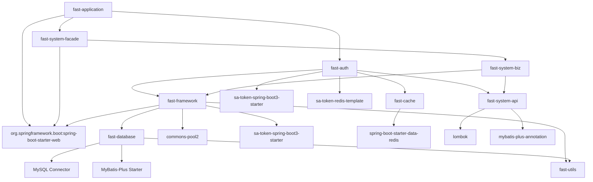

# Maven 模块依赖关系分析报告

## 模块结构概览

```
fast-admin-v2 (root)
├── fast-utils                   # 工具类模块
├── fast-database               # 数据库基础模块  
├── fast-framework             # 核心框架模块
├── fast-cache                 # 缓存模块
├── fast-system/               # 系统模块（聚合）
│   ├── fast-system-api        # 系统API接口
│   ├── fast-system-biz        # 系统业务逻辑  
│   └── fast-system-facade     # 系统外观层
├── fast-auth                  # 认证模块
└── fast-application          # 应用启动模块
```

## 依赖关系图



## 详细依赖分析

### 1. 应用层 (fast-application)
**角色**: 应用启动入口
**依赖**: 
- ✅ `fast-auth` - 认证功能
- ✅ `fast-system-facade` - 系统外观层  
- ✅ `spring-boot-starter-web` - Web框架

**分析**: 依赖结构清晰，作为启动模块聚合了必要组件。

### 2. 认证模块 (fast-auth)
**角色**: 身份认证与授权
**依赖**:
- ✅ `fast-framework` - 核心框架支持
- ✅ `fast-system-api` - 系统接口（用户信息）
- ✅ `fast-cache` - 缓存支持（Redis会话）
- ✅ `sa-token-*` - 认证框架

**分析**: 合理的认证模块设计，通过API接口获取用户信息。

### 3. 系统模块层
#### fast-system-facade (外观层)
**依赖**:
- ✅ `fast-system-biz` - 业务逻辑层
- ✅ `spring-boot-starter-web` - Web支持

#### fast-system-biz (业务层)  
**依赖**:
- ✅ `fast-system-api` - 接口定义
- ✅ `fast-framework` - 框架支持

#### fast-system-api (接口层)
**依赖**:
- ✅ `lombok` - 代码简化
- ✅ `mybatis-plus-annotation` - ORM注解

**分析**: 完美的三层架构，接口→业务→外观，依赖方向正确。

### 4. 框架层 (fast-framework)
**角色**: 核心框架，整合基础组件
**依赖**:
- ✅ `fast-database` - 数据库操作
- ✅ `fast-utils` - 工具类
- ✅ `commons-pool2` - 连接池
- ✅ `sa-token-spring-boot3-starter` - 认证框架

**分析**: 作为框架层合理整合了基础设施组件。

### 5. 基础设施层
#### fast-database
**依赖**:
- ✅ `mysql-connector-j` - MySQL驱动
- ✅ `mybatis-plus-spring-boot3-starter` - ORM框架
- ✅ `fast-utils` - 工具支持

#### fast-cache
**依赖**:
- ✅ `spring-boot-starter-data-redis` - Redis支持

#### fast-utils
**依赖**:
- ✅ `jbcrypt` - 密码加密
- ✅ `ksuid` - ID生成

**分析**: 基础设施模块职责单一，依赖合理。

## 依赖问题分析

### ✅ 已解决的问题
1. **循环依赖**: 之前 `fast-database` 和 `fast-system-api` 之间的循环依赖已通过接口依赖倒置解决
2. **架构分层**: 清晰的分层架构，依赖方向自上而下

### ⚠️ 潜在优化点

#### 1. 认证模块依赖过多
```
fast-auth 依赖了:
- fast-framework (重量级)  
- fast-system-api (业务相关)
- fast-cache (基础设施)
```
**建议**: 考虑将认证相关功能内聚到 `fast-framework` 或创建更轻量的认证接口。

#### 2. 框架模块职责边界
`fast-framework` 同时包含了:
- 数据库操作 (fast-database)
- 认证支持 (sa-token)  
- Web支持 (spring-boot-starter-web)

**建议**: 考虑拆分或明确框架模块的职责范围。

#### 3. 版本管理一致性
所有内部模块都使用 `0.0.1-dev` 版本，外部依赖版本管理良好。

## 架构评分

| 维度 | 评分 | 说明 |
|------|------|------|
| 分层清晰度 | 9/10 | API→BIZ→FACADE 分层优秀 |
| 依赖方向 | 9/10 | 自上而下，符合DDD原则 |
| 模块内聚 | 8/10 | 大部分模块职责单一 |
| 循环依赖 | 10/10 | 已完全解决 |
| 可测试性 | 9/10 | 接口层支持良好的单元测试 |
| **总体评分** | **9/10** | **优秀的架构设计** |

## 建议行动计划

### 优先级 1 (可选优化)
- [ ] 考虑认证模块的轻量化重构
- [ ] 明确 `fast-framework` 的边界职责

### 优先级 2 (长期规划)  
- [ ] 考虑微服务拆分时的模块重组
- [ ] 建立依赖版本的自动化管理

## 结论

当前的 Maven 依赖架构整体**非常健康**，主要优点：

1. ✅ **无循环依赖** - 通过接口依赖倒置成功解决
2. ✅ **清晰分层** - API/BIZ/FACADE 三层架构优秀  
3. ✅ **依赖方向正确** - 自上而下，符合架构原则
4. ✅ **模块职责明确** - 大部分模块内聚性良好
5. ✅ **版本管理规范** - 外部依赖版本统一管理

**建议**: 保持现有架构稳定，可在后续迭代中考虑认证模块的进一步优化。